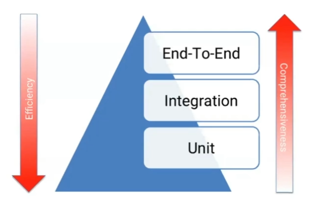
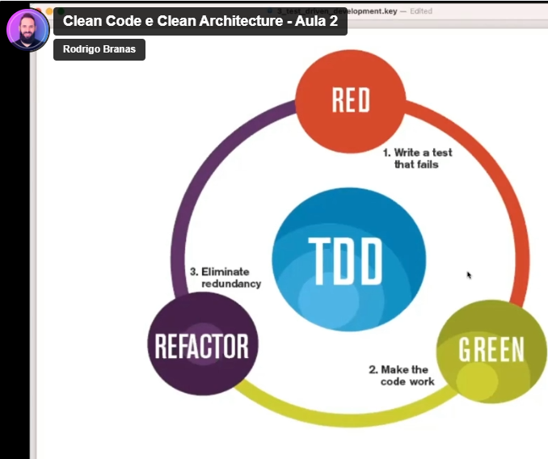
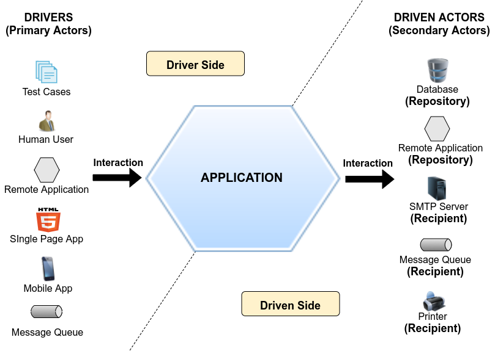
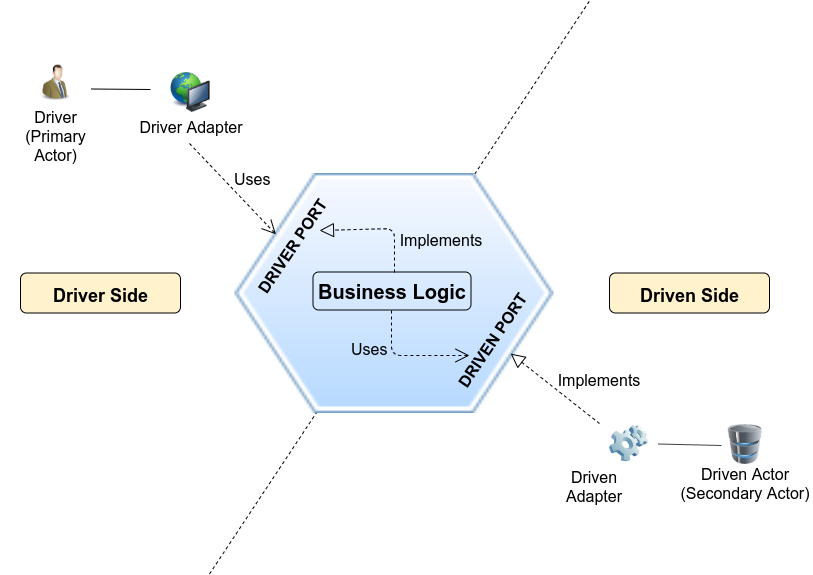
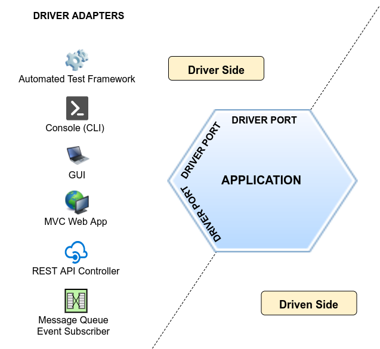
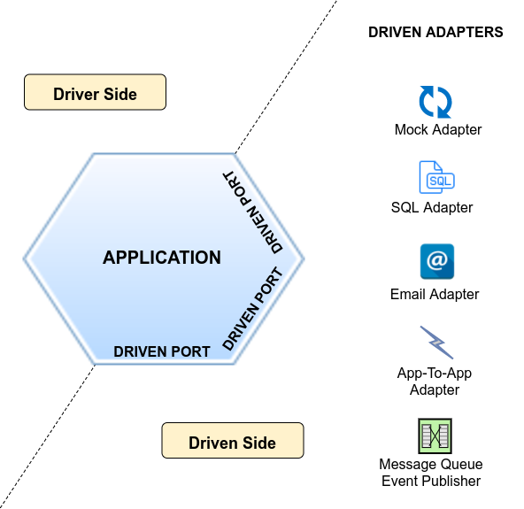
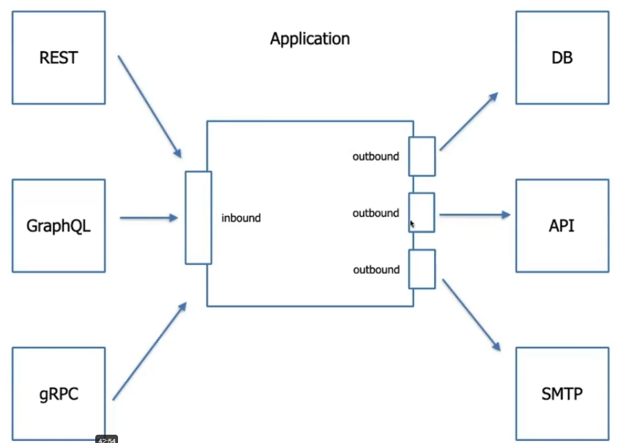
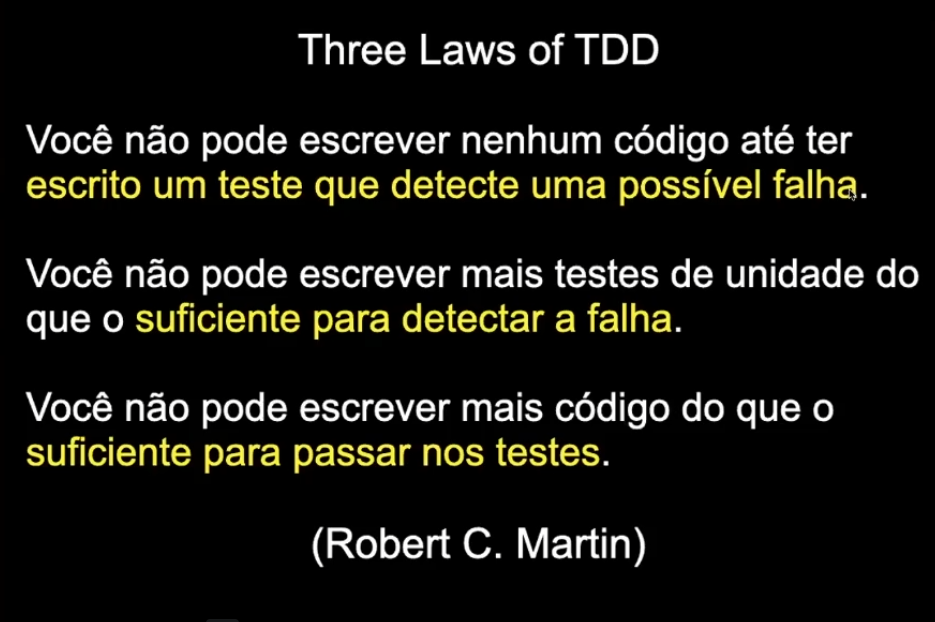
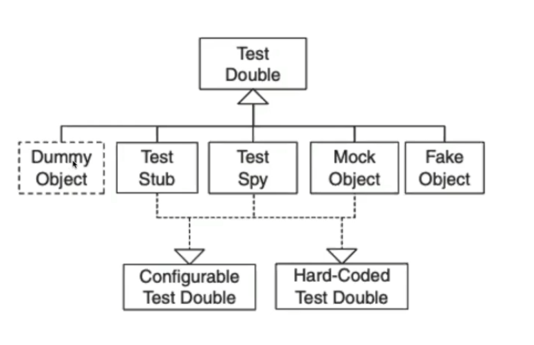

# Clean Code e Clean Architecture.(turma 8)
<p>
Repositório utilizado para armazenar esboços de códigos realizados 
no curso ministrado por Rodrigo Branas.
</p>

#### Setup:
###### Tools:
    node: https://nodejs.org
    nvm: https://github.com/nvm-sh/nvm
#### Steps:
##### Inicializando projeto node: 
    #npm init -y
    Obs: verificar se o arquivo de dependências(package.json) e scripts de execução do TypeScript e Testes foram criados.
##### TypeScript Install: utilizar npm ou yarn.
    Obs: Caso não tenha o yarn
    #npm install --global yarn
##### Testing Dependencies:(npm ou yarn)
    #yarn add typescript jest @types/jest ts-node ts-jest        
    #npm install typescript jest @types/jest ts-node ts-jest   
##### Criar Arquivo tsconfig.json
    #npx tsc --init        
##### Configuração do Jest:
    #npx ts-jest config:init
##### Ajustar tsconfig.json
```javascript            
{
    "compilerOptions": {
    "incremental": true,
    "target": "es2016",
    "module": "commonjs",
    "outDir": "./dist",
    "strict": true,
    "esModuleInterop": true
    },
    "include": [
        "src",
        "test"
    ]
}
````
##### Testando se tudo deu certo.
    Criar pastas:
        /src 
        /test 
    Criar arquivo dentro da pasta test:
        Circle.test.ts

````ecmascript 6
import Circle from "../src/Circle";

test("Should calculate the area of circle", function () {
    const circle = new Circle(2);
    expect(circle.getArea()).toBe(12.566370614359172);
});
````
    Criar arquivo dentro da pasta src:
        Circle.ts
````ecmascript 6
export default class Circle {

   constructor (readonly radius: number) {
   }

    getArea() : number {
        return 2 * Math.PI * this.radius;
    }
}
````
##### Executar:
    #npx jest    
    Obs: se os testes executaramm com sucesso, esta tudo certo.
    #npx jest --coverage 
    Obs: Coverage command file local /coverage/lcov-report/index.html
##### Resultados Esperados:
    * Ter um olhar mais crítico e profissional em relação ao desenvolvimento de software, elevando seu nível de maturidade e buscando sempre 
      criar um ambiente de qualidade;
    * Saber aplicar diversas técnicas de Clean Code e Refactoring com o objetivo de tornar o código mais limpo e comprrensível;
    * Entender como desenvolver utilizando Test-Driven Development;
    * Dominar os princípios da Programação Orientada a Objetos;
    * Saber como estruturar a arquitetura da sua aplicação utilizando Clean Architecture e Domain-Driven Design;
    * Conhecer vários Design Patterns e entender como eles podem ajudar a criar códigos mais desacoplados e manutenível;
    * Aplicar os SOLID principles na prática;
    * Entender aonde faz sentido aplicar EventSourcing e CQRS;
    * Se tornar uma pessoa muiuto mais conffiante no dia a dia de trabalho, 
      discussões técnicas, entrevistas de emprego e em outras situações onde seja 
      necessário discutir sobre arquitetura de software;


    

#####Lista de livros recomendados:

    Clean Code: 
        https://www.amazon.com.br/Clean-Code-Handbook-Software-Craftsmanship/dp/0132350882/ref=sr_1_1?__mk_pt_BR=%C3%85M%C3%85%C5%BD%C3%95%C3%91&crid=1C1LR8F75FMX3&keywords=clean+code&qid=1647211681&sprefix=clean+cod%2Caps%2C267&sr=8-1&ufe=app_do%3Aamzn1.fos.4bddec23-2dcf-4403-8597-e1a02442043d
    Refactoring: 
        https://www.amazon.com.br/Refactoring-Improving-Existing-Addison-Wesley-Signature-ebook/dp/B07LCM8RG2/ref=sr_1_2?__mk_pt_BR=%C3%85M%C3%85%C5%BD%C3%95%C3%91&crid=1KCBU11B6EJNY&keywords=refactoring&qid=1647211692&sprefix=refactor%2Caps%2C184&sr=8-2&ufe=app_do%3Aamzn1.fos.25548f35-0de7-44b3-b28e-0f56f3f96147
    Working Effectively with Legacy Code:
        https://www.amazon.com.br/Working-Effectively-Legacy-Code-English-ebook/dp/B005OYHF0A/ref=sr_1_1?crid=2XRIRTBT4GUBW&keywords=working+effectively+with+legacy+code&qid=1647211708&sprefix=working+effectively%2Caps%2C181&sr=8-1&ufe=app_do%3Aamzn1.fos.25548f35-0de7-44b3-b28e-0f56f3f96147
    Clean Architecture: 
        https://www.amazon.com.br/Clean-Architecture-Craftsmans-Software-Structure-ebook/dp/B075LRM681/ref=sr_1_1?__mk_pt_BR=%C3%85M%C3%85%C5%BD%C3%95%C3%91&crid=26Z21WEYS5FZS&keywords=clean+architecture&qid=1647211718&sprefix=clean+architectu%2Caps%2C182&sr=8-1&ufe=app_do%3Aamzn1.fos.4bddec23-2dcf-4403-8597-e1a02442043d
    Patterns of Enterprise Application Architecture: 
        https://www.amazon.com.br/Patterns-Enterprise-Application-Architecture-Martin/dp/0321127420/ref=sr_1_1?__mk_pt_BR=%C3%85M%C3%85%C5%BD%C3%95%C3%91&crid=34NOSXDMJ184T&keywords=patterns+of+enterprise+application+architecture&qid=1647211732&sprefix=patterns+of+enterprise+application+architectu%2Caps%2C183&sr=8-1&ufe=app_do%3Aamzn1.fos.25548f35-0de7-44b3-b28e-0f56f3f96147
    Implementing Domain-Driven Design: 
        https://www.amazon.com.br/Implementing-Domain-Driven-Design-English-Vaughn-ebook/dp/B00BCLEBN8/ref=sr_1_1?__mk_pt_BR=%C3%85M%C3%85%C5%BD%C3%95%C3%91&crid=1L4M1SEQK6FWC&keywords=implementing+domain-driven+design&qid=1647211746&sprefix=implementing+domain-driven+design%2Caps%2C173&sr=8-1&ufe=app_do%3Aamzn1.fos.25548f35-0de7-44b3-b28e-0f56f3f96147
    Design Patterns: 
        https://www.amazon.com.br/Design-Patterns-Object-Oriented-Addison-Wesley-Professional-ebook/dp/B000SEIBB8/ref=sr_1_2?__mk_pt_BR=%C3%85M%C3%85%C5%BD%C3%95%C3%91&crid=31O9IGHNFGE8I&keywords=design+patterns&qid=1647211761&sprefix=design+pattern%2Caps%2C188&sr=8-2&ufe=app_do%3Aamzn1.fos.25548f35-0de7-44b3-b28e-0f56f3f96147
    Patterns, Principles and Practices of Domain-Driven Design: 
        https://www.amazon.com.br/Patterns-Principles-Practices-Domain-Driven-Design/dp/1118714709/ref=sxts_rp_s1_0?__mk_pt_BR=%C3%85M%C3%85%C5%BD%C3%95%C3%91&crid=31O9IGHNFGE8I&cv_ct_cx=design+patterns&keywords=design+patterns&pd_rd_i=1118714709&pd_rd_r=68f35d70-0e11-4052-9b33-72fd368e0e21&pd_rd_w=VBfal&pd_rd_wg=RA5SF&pf_rd_p=2ed3c95d-fb99-4567-8b9a-89b24a300075&pf_rd_r=CD05B2P7AKBDYQRWY8N7&psc=1&qid=1647211771&sprefix=design+pattern%2Caps%2C188&sr=1-1-f0029781-b79b-4b60-9cb0-eeda4dea34d6&ufe=app_do%3Aamzn1.fos.25548f35-0de7-44b3-b28e-0f56f3f96147
    Extreme Programming: 
        https://www.amazon.com.br/Extreme-Programming-Explained-Embrace-English-ebook/dp/B00N1ZN6C0/ref=sr_1_1?__mk_pt_BR=%C3%85M%C3%85%C5%BD%C3%95%C3%91&crid=2YMSOJ2JPV55O&keywords=extreme+programming&qid=1647211916&sprefix=extreme+programmi%2Caps%2C223&sr=8-1&ufe=app_do%3Aamzn1.fos.25548f35-0de7-44b3-b28e-0f56f3f96147
    Microservices Patterns: 
        https://www.amazon.com.br/Microservice-Patterns-examples-Chris-Richardson/dp/1617294543/ref=sr_1_1?__mk_pt_BR=%C3%85M%C3%85%C5%BD%C3%95%C3%91&crid=1BCDZ332GNCC3&keywords=microservices+patterns&qid=1647211958&sprefix=microservices+pattern%2Caps%2C182&sr=8-1&ufe=app_do%3Aamzn1.fos.4bddec23-2dcf-4403-8597-e1a02442043d
    xUnit Patterns: 
        https://www.amazon.com.br/Xunit-Test-Patterns-Refactoring-Code/dp/0131495054/ref=tmm_hrd_swatch_0?_encoding=UTF8&qid=1656968887&sr=8-1
    Domain-Driven Design: 
        https://www.amazon.com.br/Domain-Driven-Design-Tackling-Complexity-Software/dp/0321125215/


# Aula 1:
    O código-fonte é tão bagunçado que você não sabe nem por onde 
    começar a desenvolver uma nova funcionalidade ou corrigir um defeiro?
##### Priorizar códigos que só uma pessoa saber mexer.
    Disseminar conhecimento respeitando os níveis técnicos.
    fazer pair programming, centralização de conhecimento não é legal.
##### Você tem medo de mexer em uma coisa e etragar outra? tem medo detrabalhar no core domain do projeto ? (se você tem medo não refatora)
    Testabilidade é um fator essencial para pontos complexos e sensíveis ao negócio.
 
 
##### Existem mais defeitos para corrigir do que novas funcionalidades para implementar.
    Como manter uma pessoa feliz que só corrige defeitos, dívidas acumuladas que não foram pagas(bugs)?
    Temos que ser profissionais e éticos com nosso trabalho, e o fato de não refatorarmos e testarmos afetam 
    resultados que estamos tentando buscar.
    Não podemos aceitar certos comentários de pessoas que não entender nosso trabalho, 
    Você iria dizer para um médico como ele deve operar alguém?]
    Dar opinião de um assunto que não entendo, não devemos aceitar opinião de quem não tem noção
    mas devemos ouvir e explicar que não faz sentido.  
##### Trabalhar sob pressão
    Precisando parar atividades no meio para fazer outra coisa mais 'urgente' 
    e eventualmente até te pedem para fazer hora extra?
    Muitas demandas pode ser bom pois o negócio esta crescendo, mas
    sob pressão podemos tomar decisões erradas, horas extras sim, mas tudo tem limite.
##### Ninguém tem coragem de fazer deploy na sexta-feira:
    Você tem coragem de fazer um deploy a qualquer hora do dia ?
    esse é um bom teste de maturidade. 
    Quando se tem Testabilidade e Resiliência.
    
##### Por quê isso tudo acontece ?
    Forma pelo qual o código foi implementado.
    Temos que nos atentar a indentação, nomes que fazem sentido
    condições de cadeias de IFs, quantidade de linhas.
    Algumas coisas de forma inconsciente diz que o código esta ruim.

    Qualidade de código não é sinonimo de sucesso. (Você pode fracassar comercialmente)
    Mas ter um código ruim, afetam no custo, retenção, manutenção.
    
##### Passamos mais tempo LENDO o código do que ESCREVENDO:
    Ja virou a noite codando por conta de um incidente ?
    as vezes uma linha resolve esse problema, mas porque levamos a noite toda?
    porque o gargalo não esta na digitação e sim (aonde e como), o ponto exato do codigo para resolver.
    
##### Bob: nosso desafio é reduzir ou pelo menos manter o esforço de desenvolvimento constante com o passar do tempo:
    Na 1º semana do projeto passamos bastante tempo codando, mas a medida que o tempo passa
    codamos menos, a produtividade é reduzida, quanto mais antigo o projeto menor a produtividade
    para virar esse jogo é investir em refactoring, testes, modelagem estrategica desacoplando negocios (DDD)
    mas da trabalho sair disso.

##### Existe um paradoxo entre dois valores, COMPORTAMENTO e ESTRUTURA:
    Comportamento = stakeholders, ganham ou economizam dinheiro. 
    
    Se depender do cliente não vamos refatorar ou testar, criar microservices, containers, usar DDD o cliente
    ou o stakeholder não estão interessados, oq importa para ele é escopo e funcionalidades.
    Mas como ela não é da área e não domina as tecnicas, escrever só comportamento a tendência é que 
    a estrutura não vai suportar.
    
    Temos que equilibrar a Estrutura pois é oq mantém o projeto de pé sem colapsar.
    Quando custo x maior receita, rotatividade, produtividade, defeitos. 

##### Pense na estrutura como:
    Métodos, Classes, Módulos, Serviços 
    e a Relação entre cada um deles. 

##### Quanto mais comportamento adicionado, mais estrutura:
    Quanto mais comportamento for adicionado ao software, mais estrutura será necessária para suportá-lo
    de forma eficaz.
    Ex:SOLID, Design Patterns DDD, POO = como trazer ESTRUTURA para o COMPORTAMENTO.

##### Existe uma disputa por comportamento de um lado e estrutura de outro: 
    Sempre vai ter uma força fazendo com que você abra mão de uma melhoria. 
    Não tente explicar para alguém que não é da área a importancia da estrutura
    ela não vai entender, devemos incorporar isso na estimativa.

    Menos produtividade = menos motivação
    Ninguém se sente bem fazendo gambiarra
    Já pediu demissão alguma vez porque não aguentava mais o projeto?

##### Qualidade do código afeta a rotatividade.

    O que motiva uma pessoa? algumas são: 
    * Dinheiro;
    * Ambiente de trabalho;
    * Crescimento profissional;
    Esses 3 fatores equilibrados motivam equipe e refletem nos resultados.
    
    Para quem lidera um time.
    * Esse tipo de problema afeta a empresa inteira.

#### Como funcionam as estimativas onde você trabalha?
    * Esforço X Data Entrega: são coisas diferentes.
    * Somar na estimativa a incerteza com códigos ruins.
      Obs: No decorrer do desenvolvimento podemos encontrar imprevistos. 
      e a Incerteza faz com que a estimativa seja extremamente elástica.
    * Acertar estimativas tem a ver com o nível de controle sobre o ambiente
      estruturas frágeis nos levam a falhas de estimativas.
    
    * Clientes vão reportar cada vez mais problemas =  ambiente mais caótico.
    * Ao longo das releases a produtividade cai, pois perdemos tempo procurando 
      aonde devemos realizar o ajuste.

#### A base para se ter uma empresa sob controle é ter o código sob controle. 
    * Com a concorrência cada vez maior, o comercial começa a vender menos. 
    * O impacto financeiro aparece. 

#### Afinal o que é Clean Code?
    * Qualquer livro que lide com isso tras ideias parecidas. 
    * Clean code é simples e direto: mas isso é dificil de 
      se fazer pois é dificil ser simples e direto;
      (Grandy Booch criador doo UML)
    * A logica deve ser clara e direta para fazer para fazer 
      com que sejam dificeis para os defeitos se esconderem.
      (Bjarne Stroustrup, criador do C++)
    * Clean code sempre se parece com código escrito por alguém que se importa.
      (Michael Feathers) Working Effectively with legacy code.
    * Voce olha o código e cada trecho é exatamente aquilo que você esperava que fosse
      você esta lidando com código de qualidade.
      (Ward Conningham (criador da wiki)) 
    * Qualquer um escreve código que o computador entenda, agora bons programadores 
      escrevem códigos que outros seres humanos conseguem entender.  
      (Martin Fowler)
#### Como medir qualidade de código?
    Medir por, linhas, qtd métodos ?, tamanho dos métodos? complexidade?
    escrever sobre algo que nos importamos.    
    
    Mas é pela quantidade de WTFs por minutos.
    você já xingou o autor do código? se você já fez isso é pq o código esta mal mesmo.
    
#### Acumulo de comportamento sem estrutura.
    Negligencia e acumulo de divida técnica. 


    Imagine trabalhar nesse ambiente.
    Nenhum ambiente fica nesse estado de uma hora para outra. 

    E parecido com a metáfora da janela quebrada.
    Ex: tem um prédio abandonado com algumas janelas e todas intactas
    mas no momento que a primeira janela é quebrada, as outras também começaram a ser vandalizadas.
    
    * Ah mas a pessoa não quer priorizar uma atividade de refactoring!
    Refactoring não é uma atividade e sim uma prática do dia a dia, na forma como você se expressa.
    Essa cozinha não ficou suja do dia para a noite, foram vários dias de negligencia.
    O mesmo acontece com o código.    

    
#### Ponto de não retorno (Refatore antes que seja tarde!). 
    * Chega uma hora que a dívida esta tão alta que o único jeito é jogar tudo fora e refazer.
      e é mais rápido refazer.
    Obs: Muitas vezes, existe um ponto de não retorno, evite chegar lá, poderá ser muito 
         caro e muito arriscado fazer qualquer mudança. 


### Refactoring.
    Alteração feita na estrutura interna do software para torná-lo mais fácil 
    de ser entendido e menos custoso de ser modificado, sem alterar o seu 
    comportamento observável. (Martin Fowler)

    É um investimento, torna o software sustentável e competitivo. 
     
    Ou você refatora ou faz melhorias, fazer as duas ao mesmo tempo não é o ideal.
    Com o tempo a gente vai escrevendo códigos de boa qualidade automaticamente.  

    Ao negligenciar o rendimento da equipe vai cair, 30 min de refactoring hoje é uma economia 
    economiza 30min de cada um e acaba se pagando.
    
    * Refactor com um propósito, evite refatorar apenas por refatorar.
    * Fique atendo as oportunidade. Introduza o refactoring em todas as tarefas. 
      Obs: é um trabalho de formiguinha. 

#### Muitas empresas precisam contrair algumas dívdidas para <br> crescer e escalar sua operação.
    
    Cuidado, com o aumento da dívida técnica, os juros são bem altos. 
    mantenha a dívida sob controle
    
    * Se nos queremos considerar linhas de código, devemos pensar em não em linhas produzidas 
    mas sim quantas linhas você gasta para resolver um problema (Edsger Dijkstra)
    Quando mais objetivo você for, melhor é.
    
    Refactoring não se aplica somente no código.  


    Conforme aplicamos técnicas de refactoring, tanto o código vai ficando melhor
    escrito, quanto ele começa a externalizar comportamento que precisa ser colocado 
    em algum lugar.

    Dessign: A extração em métodos e funções quando param em outras classes
    e essas classes precisam se relacionar isso a gente chama de design.
    
    Architecture: Ex: pegar 10 classses e jogar para um microserviço
    para que outros sistemas tenham acesso a info, novos componentes 
    precisam de interação, e essa interação se torna parte da arquitetura.
    Feita de decisões importantes e difíceis de mudar(linguagem, framework, tipo de comunicação, sync, async?).
    
    Código: mera sequência de instruções.  
     
#### Como evitar que o problema aconteça?
    
    * Reconhecer e lidar no dia a dia com os code smells
      tomando ações necessárias.
    * Um Smell é um sintoma que ocorre dentro do código fonte
      e que pode se rum indicador de problema. 


# Refactoring

###Smells

Sempre escrever testes antes, assim perdemos o medo e ganhamos mais confiança no refactoring.

##### 1 - Nome Estranho.
    Ação: Renomear variáveis, métodos, funções, classes, arquivos. 
    cccat8_refactoring_1/v1
    Ex: O que são ? 
    calc.ts = calculateRide
    dist = distance
    ds = date
    mov = segment
    movArray = segments (segmentos dentro da corrida)
    result = fare (tarifa)  
    
    Obs: Identificar os nomes estranhos e refacotrar
    após alguns renames, devem ser executados os testes novamente. 

##### 2 - Linhas em branco
    Ação: apagar linhas em branco, extrarir em métodos.

    Linhas em branco não servem para absolutamente nada.
    Cada pessoa do time tem o seu 'jeito' de utilizar as linhas em branco
    então é interessante definir um padrão. 
    
    Ideal não utilizar linhas em branco dentro dos métodos.
    (assim conseguimos ver mais código, ou quase o método todo praticamente.)
    
    Linhas em branco deixa o código mais legivel?
    sim, mas podemos substituir essas linhas por extrações de métodos ou design de classes. 

    * Rolar o scroll do mouse toda a vez é ruim! classes grandes são legais.
      Medida ideal de altura é a que couber no seu monitor :)


##### 3 - Comentários
    Ação: Introduzir variáveis explicativas, extrair em métodos
    apagar comentários.

##### 4 - Código Morto. (é diferente de comentário.)
    Ação: Código comentado deve ser apagado.

##### 5 - Condições confusas e aninhadas - Simplificar Condições. 
    Ação: Inverter condições ou introduzir cláusas guarda.(inverter condições para eliminar elses)
    Obs: após inverter condições else toamr cuidado com identação. 
    Ação: Consolidar Condições: Quando tempos condição depois de condição, incluindo legibilidade
    introdução de if ternarios, 
    extrair condições

##### 6 - Números mágicos 
    Ação: Extrair para constantes explicativas.

##### 7 - Tratamento inadequado de exceptions.
    Ação: introduzir tratamento de exceptions

##### Começando a resolver com Design
    POO é a arte de preservar invariancia.
    Pegar classes grandes dividir em classes menores, 
    e deixar cada classe com suas regras, diminuindo complexidade.

##### 8 - Excesso de parâmetros
    Quanto menos melhor
    Instruduzir instancias para reduzir parametros 

##### 9 - Métodos grandes
    extrair métoso

##### 10 - Classe grande
    extrair classe

### Anotações Aula2

    ORDEM: code > design > architecture.
    
    Dica: ir desdobrando as coisas, extraindo em métodos, classes etc...
    para reduzir tamanho, simplificar condicionais,
    e ficar mais fácil testar a nível de unidade.
    Mas apos a extração temos um problema pois temos que avançar para o design
    e assim trabalhamos com informações e códigos que tem relação de négócio.


##### 1 Design Patterns - Strategy, Factory e Chain of Responsibility
    POO: Proteção de invariancia, protege as caracteristicas interna 
    dos objetos com modificadores de visibilidade que promovem encapsulamento.
    * Diciplina da transferencia indireta de controle.
    Ex: metodo calculateFare na classe Ride transfere a responsabilidade do calculo.

    Strategy: Define familia de algoritmos devidamente encapsulados que podem ser intercambiaveis
    faz com q vc possa variar o algoritmo dependendo da forma de utilizacao
    Polimorfismo: (Contrato Interface -> e + 4 Fare algoritimos que podem ser intercambiaveis.) 

    Factory: 
    Existem 2 tipos abstract factory: interface para criação de familia de objetos
    Factory method: interface pra criacao de objeto e a subclass defina quem deve implementar(polimorfismo).

    Chain of Responsability
    Chain = cadeia, rede, sequencia
    Responsability = responsabilidade, comportamento.

    O reafactoring usando design patterns leva em consideração todas as regras da aula 1
    classe grande, métodos grandes, excesso de params, tratamento inadequado de exceptions etc...

##### 2 Testes (Test-Driven Development) - Parte 1

    Ter testes "não é uma garantia de que não vão existir defeitos".
    Mas reduz as chances e da coragem em refatorações. 
    Defeitos sempre acontecem e os testes vão minimizar.

    1º sintoma: você fica torcendo para que o código funcione durante o desenvolvimento até produção
    Obs: sinal que poderiam existir mais testes e um processo de desenvolvimento mais maduro.
    2º Decorar dados que precisam ser digitados na tela para testar uma determinada funcionalidade.
    Obs: Perde tempo d+ decorando dado de usuários, sendo assim o teste contém essas infos.
    3º Somos bem menos produtivos do que poderíamos ser. quem é mais rápido você ou o computador ?
    4º Eventualmente mexer em uma coisa estraga outra. (as coisas estão integradas.) 
    Obs: os testes vem para testar todos os lados do sistema, e podem ser executados inúmeras vezes. 
    5º Ficamos com medo de ajustar ou melhorar alguma funcionalidade.
    
    * 'Medo impede evolução'

    E pq não fazemos ? teste requer muita disciplina.
    Nos acostumamos a começar pela tela ou pelo banco e não pelo domínio.
    Muitas vezes não temos informações suficientes para começar a desenvolver
    e também o design e a arquitetura não ajudam para realizar a automação dos testes.

    O que é um teste automatizado ?
    Dado: conjunto de entrada 
    Quando: algo acontecer
    Então: a saída deve suprir as expectativas.

    Given/Arrange: Definição de todas as informações necessárias para executar o comportamento testado. 
    When/Act: Executar o comportamento.
    Then/Assert: Verificar o que aconteceu após execução e realizar validações com as expectativas que foram criadas.

    Quais são os tipos? Unit, Integration, EndToEnd.(esse são alguns)
    Ex: Se pararmos para testar uma bicicleta, e testarmos os componentes de forma individual 
    não necessariamente a bicicleta ira funcionar pois ela só funciona se todos estiverem integrados
    então o testes de integração também é importante.
    Nível de integração pode ser que as unidades não funcionam. 
    O End-to-End é em um nível de UseCase real com interações reais. 

    A combinação dos 3 traz o sucesso.



    * Conceito de FIRST *

    * F Fast: Testes devem rodar rápido! 
    (testes de integração são lentos principalmente em bancos relacionais)
    Relações e quantidade de registros podem deixar o teste lento por conta do IO.
    Tempo Ideal ? o menor possível.
    * I Independent: Não deve existir dependência entre testes, devem ser executados de forma isolada
    (quando 2 testes usam o mesmo registro para fazer asserts)
    Rodar teste em paralelo não temos garantia de ordem de execução.
    Rodar teste de forma objetiva: se 1 dos testes que cria dados falhar os outros que depende dele vão falar
    por isso a importância de ser independente.
    * R Repeatable: Devemos poder executar várias vezes o testes, uma data pode dar problema na repetição dos testes.
    * S Self-validating: O próprio teste deve ter uma saída bem definida que é válida ou não.
    (não utilize console logs)
    * T timely: Escritos antes do código-fonte

    OBs: (teste de integracao nao é um teste de healthcheck)

    Fluxo TDD

    
    As 3 regras do TDD
    1 - Primeiro escreva o teste que detecta a falha, após isso escreva o código.
    2 - Não escrever mais testes de unidade do que o suficiente
        Obs: Escreva 1 e resolva, ao invés de escrever 10 e tentar resolver os 10.
    3 - Escreva código suficiente até o teste passar após isso crie outro teste e faça ele passar siga esse ciclo.
        Obs: disciplina!

    

##### 3 Code Smells e Técnicas de Refactoring - Parte 2
    Refactoring da classe validade.ts
    Conforme visto anteriormente:
    (remover o que não agrega)
    1º Nome estranho 
    2º Linhas em branco.
    3º Comentários. 
    4º Código morto.
    5º condições confusas e aninhadas
    (podemos combinar ou inverter as condições, 
    geralmente tem if dentro de if o código fica cada vez mais distante da margem)
    6º números mágicos
    (a variavel deve ser declarada de fato onde ela vai ser utilizada)
    7º tratamento inadequado de exceptions
    8º excesso de parâmetros

##### 4 Implementação do Projeto - Parte 1 (TDD e Refactoring)

    CLI: yarn ou npm
    #: yarn init -y
    #: yarn add typescript jest ts-node ts-jest nodemon @types/jest
    #: npx tsc --init
    #: npx ts-jest --init
    #: npx add express @types/express pg-promise
    #: npx ts-node src/main.ts
    TEST MOCKS: #: npm add sinon
    #: npm add @types/sinon
    nodemon para auto-reload #: npx nodemon src/main.ts
    

    TESTES: 
    1-Não deve criar um pedido com CPF inválido.
    2-Deve criar um pedido com 3 itens (com descrição, preço e quantidade).
    3-Deve criar um pedido com cupom de desconto (percentual sobre o total do pedido).
    Dica: tente seguir com disciplina.
          1º teste que falha;
          2º teste passar;
          3º refatorar;

    Uma classe classifica, enquadra algo em uma determinada classificacao.

##### Ports and Adapters

    PORTS and ADAPTERS
    Antigamente era comum misturarmos responsabilidades no mesmo lugar ex: no PHP 
    utilizávamos o codigo front para conexão no banco.
    Temos que separar por camadas, 1 obtem info, 1 exibe info, 1 executa regra.
    Esse problema de design ocasionou vários problemas em aplicações antigas. 
    Se seguirmos esse padrão é muito difícil de implementar testes (quando a view tem muita responsabilidade)
<br>

    ALISTAIR COCKBURN: 
    Permitir que um aplicativo seja igualmente conduzido por usuários,
    programas, testes automatizados ou scripts em lote, e que seja desenvolvido
    e testado isoladamente de seus eventuais dispositivos de tempo de execução e bancos de dados.
    (ISOLAMENTO DISPOSITIVO DE IOs)
    


    inbounds: Lado esquerdo 'drivers' quem conduz a aplicação
    outbounds: Lado direito interação driven side: com base de dados filas ou filesystem. 

    Quando falamos de interface achamos que a nossa API rest é a nossa interface 
    mas na verdade ela é um drive e suas interfaces tem q ficar no centro.

    Criamos 2 serviços Currency e o Cards Invoces 
    como testar os 2 serviços já que eles estão integrados? 
    FIRST =
    fast, 
    independent,
    repatable,
    self-validation,
    timely 



    API é uma interface que estou expondo ao mundo e posso ter vários tipos de
    drivers, driven sides também tem portas as regras estão plugadas e expostas
    na API e usa uma interface que usa um driven externo(no caso o servico de currency).

    O hexágono não é um hexágono porque o número seis é importante, mas sim para permitir que 
    as pessoas que fazem o desenho tenham espaço para inserir portas e adaptadores conforme necessário, não sendo limitados por um desenho unidimensional em camadas. 
    O termo "arquitetura hexagonal" vem desse efeito visual
    FONTE: https://alistair.cockburn.us/hexagonal-architecture/



    (Inbound side ou driver side onde tem todos que podem interagir.)
    Quando alguém quer interagir com a aplicação: deve utilziar um adaptador específico
    para cada tipo de tecnologia (REST, GraphQL, gRPC, GUI, Queue, CLI, TEST)
    sem que a aplicação saiba qualquer detalhe sobre a forma de acesso.



    Quando a aplicação quer interagir com alguém, ela também utiliza um
    adaptador específico para cada tipo de tecnologia(SQL, API, FileSystem, Queue)
    Sem que a aplicação saiba qualquer detalhe sobre a forma de acesso(interface)

    Então: Sempre que o DRIVER olhar para a plicação ele olha para um contrato(interface ou whatever).
    E quando a aplicação interage com um DRIVEN(algum tipo de recurso) também fala com contrato.

    Temos porta dos 2 lados.



    A aplicação expõe uma ou mais portas, dispositivos se conectam nelas e a aplicação 
    recebe via injeção de dependência o driven dos recursos que ela consome.
    Faz sentido aplicar em todos os projetos.
    Podemos utilizar até no frontend(mas se aplica mais o driven). 


##### TESTS - Ports and Adapters :



    Só que nem sempre é tão simples de seguir essas 3 regras
    O que fazer quando existem entradas e saídas indiretas no componente testado?
    o teste se acaba se tornando mais complexo.

    Um test double é um padrão que tem o objetivo de substituir um DOC(depended-on component)
    em um determinado tipo de teste por motivos de performance(acessar o banco varias vezes) 
    ou segurança(acessar uma api de emissao de nota fiscal varias vezes)
    Obs: conteúdo do livro: xUnitTestPatterns.


    NEM TUDO É MOCK
    http://xunitpatterns.com/



    Dummy(fictício) = tanto faz se é joão ou maria, ou params
    que nao sao utilizados pelo comportamento que estamos testando.

    Stubs: é oq usamos pra substituir um tipo de retorno.(nao é o mock e sim stub, passa por cima de retornos.)
    Serve para substituir um component que forma uma dependência indireta que você não consegue confiar.
    na V1 do InvoiceController ficaria inviavel mockar. 
    Por isso é interessante separar as camadas.


    